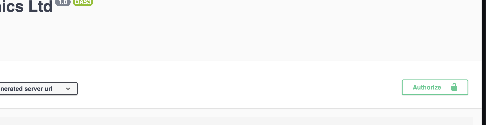

# Bullishtronics Backend  
Coding challenge for Software Engineer position.

## How to Use
____
### To run tests with Maven
```shell
mvn clean test
```
### To run the application
From your IDE, the starting point is BullishTronicsCheckoutApp,
or you can use the uber-jar (include all dependencies) created on phase```mvn package```.

```shell
java -jar bullishtronics-checkout-app/target/bullishtronics-checkout-app-1.0.0-SNAPSHOT.jar
```  

If you want to see how to test the API (Basic auth), go to **Swagger & API Usage** section.

## Some Context  
____  
I decided to work on this app as if it was an entire mini-project.  

Therefore, even if the requested app is simple, I designed the architecture of it as if I was building a complex application, 
to show you how I would 1st draft it in a high scale project. Each module is a "layer" that, ideally, is independent on how the other layers works.
i.e, you should be able to move out from jackson serialization, without impacting your pojo models, or use a different web framework (spring here)
without modifying your business logic implementation classes. This clusterisation may sacrifice a bit of readibility compare to a mono-module project,
but I believe the tradeoff is worth it when it comes to migrate from 1 project dependency to another,as we don't mix the layers in the same classes.  

- To ease the API testing, I inject fake data at application start. Look for `StoreBeansConfig` file to find these data.
- The API and swagger are using the port 10108, if you have an app listening to this port already you may want to modify this in `application.properties` file. 

## Code Walk Through  
____  
To have a first glance of how the app works, you may want to go into the `checkout-core` module, and look at the services interfaces.  

The expected usage of this API from a Client app would be the following:
- Client browse the Products page, and add some of them to his cart. Client can modify the quantities down/up. 
- Once done, Client open the Basket page, and the app requesta quotation to our API. The basket details and its quotation are displayed. 
- If Client modify the basket, the app request a new quotation, etc.
- Once ready, Client click Buy and an Order is placed based on the Quotation ID the Client's app has in memory.
  - Our API will base this order on the quotation object & reject this order if the quotation is outdated.
  - The benefit of Quotation is to fix the _source of truth_ for a period of time. Then, Client clicks BUY, it's 100% certain that the pricing he sees is what his app shows to him, even if the product price or a Deal changed in the meantime. (valid only for 15 minutes).
- If the client wants an Invoice, itwill be generated on-the-go.
  - It allows for the user to change its personal details, and generate an invoice with these. No need for us to store the invoice and restrict its generation to once.  

In terms of deals, there could be different types. User base location, multiple products package discount, Buy 3 Get 1 free, etc. These are different types of deals.  
To see all Types go to `DealType` enum. The implementation for each type of deal are in `Discounter` child classes.  
The admin can create deals dynamically, with validity start/end time, as long as there is a Discounter available for this type.  
Deals Types are stackable or not, which means that it will not add itself to other discounts if set to `False`. When doing the quotation,
The system will apply the best discount available, regarding the basket at quotation time.  

See **Swagger & API Usage** section to see how to create new Deals as **admin** user.  

Also, I made the choice to only compute the TOTAL price at Invoice step for reference to be added in the target PDF invoice file. 
The Client app can to the add/sub operations on the quotation/Order steps if it wants to display a total price.


## About testing
____  
Code coverage on the core module is ~100% with unit tests. In real application, I would have also test app module and data-adapter.  
I would never create tests on models, dtos or MixIns, as it is less relevant and the models are anyway tested through e2e tests (absents in this demo).

## Swagger & API Usage
____  
There is 3 users already loaded when the app starts to test both `ADMIN` and `CUSTOMER` roles. 
The swagger can be found on url `https://localhost:10108/swagger-ui/index.html`.  

Once you first open this page, you should have a form to connect, use admin creds preferentially...  
_Note: after 1st login you need to reload (Ctrl+R) the page to see the CSS formatting. this is not a feature.. it's a bug. . ._

```shell
#admin role
login: admin
password: admin

#customer role (empty basket)
login: user
password: user

#customer role (with active basket)
login: buyer
password: buyer
```

If you want to change your logged-in user for ALL endpoints, you can click on the green lock on top of the endpoints list:  


You also have Grey locks on each endpoint to manage the Basic Auth individually.  

If this is your 1st time with swagger, choose the endpoint based on the controller. once you want to use the endpoint,
click on "try it out" to be able to parameterize the call, and click "Execute" button once you are ready. The response will be displayed below.


**Regarding Deals creation**, the swagger is not really helpful as the Deal endpoint accept polymorphic inputs.  
To know the exact name of fields expected for a Deal type, go to the `serialization module` and look for the mixin associated to it.  
For instance, look at `GlobalDealDetailsMixIn` file to see the fields required.
```shell
# Example for Global Deal (Type: GLOBAL_PERCENT) - Based on GlobalDealDetailsMixIn
{
  "tagline": "GET 10% OFF ON ALL THE WEBSITE",
  "startTime": "2023-01-01T05:16:35.985Z",
  "endTime": "2023-02-01T05:16:35.985Z",
  "dealType": "GLOBAL_PERCENT",
  "percent": 10
}
```
```shell
# Example for Item Modulo Discount (Type: ITEM_MODULO_LAST_ITEM_PERCENT) - Based on ItemModuloLastPercentDealDetailsMixIn
{
  "tagline": "BUY 2 SAMSUNG SD CARD, 50% OFF the third",
  "startTime": "2023-01-04T05:16:35.985Z",
  "endTime": "2023-02-04T05:16:35.985Z",
  "dealType": "ITEM_MODULO_LAST_ITEM_PERCENT",
  "percent": 50,
  "moduloNumber": 3,
  "productId": "product1"
}
```  

## Bonus: How to add a new type of Deals  
____

Adding a new type of deal is easy once you know what steps you need to follow :

- Create a new model extending the `Deal` model and create a new `DealType` **(model module)**
- Create a `XXXDto` matching this model and add the new `DealTypeDto` **(io module)**
- Create an `XXXAdapter` for this dto, inject it in `DealDtoAdapter` **(data-adapter module)**
- Instantiate this adapter in `AdapterBeansConfig` **(app module)**
- Create an extension of `DealDetails` matching what this new model needs. **(model module)**
- Implement in the `DealFactory` for this new `Deal` / `DealDetails` pair. **(core module)**
- Create a `XXXMixIn` for this new details object, register it in `MixinsConfig`, and add the correct mapping in `DealDetailsMixIn` (serialization module)**
- Create the `Discounter` holding the Business logic. **(core module)**
- Instantiate this new discounter in `ServiceBeansConfig` **(app module)**.
  

- _Bonus: For easy test, you can inject a sample deal at start (`StoreBeansConfig`, app module)._ 
  - _Otherwise, you can use the swagger. Rely on the `XXXDetailsMixIn` definition to knowthe fields you have to provide._
